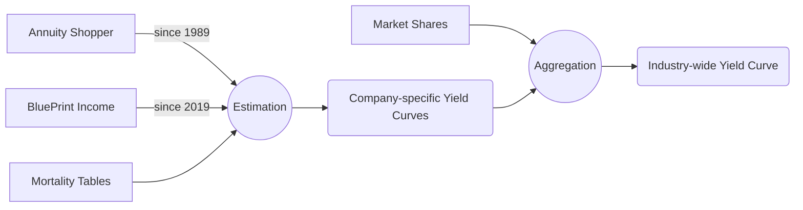

```mermaid
graph LR
A[Annuity Shopper] -- since 1989 --> B((Estimation))
C[BluePrint Income] -- since 2019 --> B((Estimation))
H[Mortality Tables] --> B((Estimation))
B((Estimation)) --> D(Company-specific Yield Curves)

F[Market Shares] --> E((Aggregation))
D(Company-specific Yield Curves) --> E((Aggregation))
E((Aggregation)) --> G(Industry-wide Yield Curve)
```